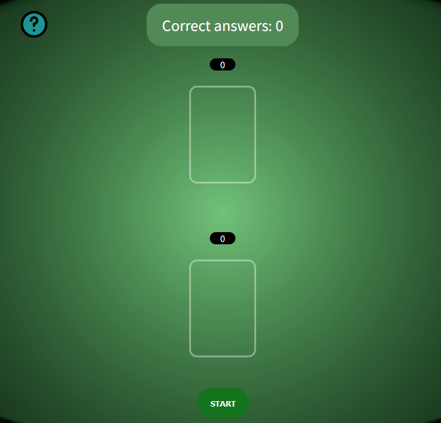

# Blackjack Trainer App

[](https://reactjs.org/)
[](https://www.typescriptlang.org/)
[]()

A Polish-language Blackjack training application for learning card counting and basic strategy.

## Features

- **Blackjack Simulator** - Realistic gameplay with accurate rules
- **Card Counting Drills** - Practice keeping track of the count
- **Strategy Trainer** - Learn basic strategy and deviations
- **Educational Content** - Articles about Blackjack techniques
- **Mobile Responsive** - Works on all device sizes
- **Game Statistics** - Track your progress and improvement

## Technologies

- React 18 with TypeScript
- Emotion for CSS-in-JS styling
- React Router v6 for navigation
- React Query for state management
- Custom game engine implementation

## Getting Started

### Prerequisites

- Node.js v16+
- npm v8+

### Installation

```bash
# Clone repository
git clone https://github.com/your-repo/BJreactapp.git

# Install dependencies
cd BJreactapp
npm install

# Start development server
npm start
```

## Project Structure

```
src/
├── assets/       # Images and icons
├── components/   # Reusable UI components
├── contexts/     # State management
├── hooks/        # Custom hooks
├── pages/        # Application screens
├── utils/        # Helper functions
└── App.tsx       # Root component
```

## Screenshots

  
_Main game interface_

  
_Card counting exercise_
